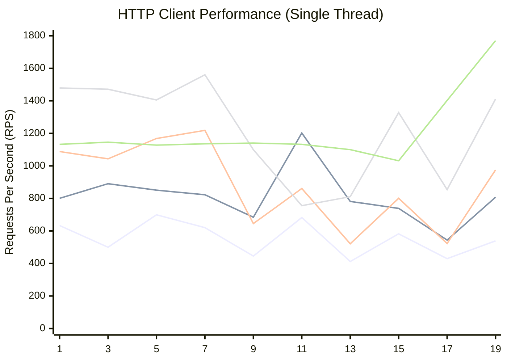

# Single Thread Performance Benchmark

## Test Configuration
- **Target URL**: `http://127.0.0.1/get`
- **Concurrency**: 1 (Single Thread)
- **Duration**: 1s to 19s (step 2s)
- **Clients**: `requests`, `aiohttp`, `httpx`, `urllib3`, `pycurl`

## Benchmark Results (RPS)

| Duration (s) | requests | aiohttp | httpx | urllib3 | pycurl |
|:---:|:---:|:---:|:---:|:---:|:---:|
| 1 | 633.19 | 800.52 | 1088.21 | 1479.21 | 1132.53 |
| 3 | 499.74 | 890.51 | 1043.49 | 1471.45 | 1145.69 |
| 5 | 699.20 | 850.95 | 1168.54 | 1405.46 | 1127.74 |
| 7 | 620.34 | 822.40 | 1218.53 | 1560.40 | 1135.83 |
| 9 | 445.33 | 684.18 | 645.14 | 1099.59 | 1140.51 |
| 11 | 682.62 | 1201.96 | 860.85 | 755.51 | 1132.49 |
| 13 | 412.13 | 781.62 | 521.20 | 810.64 | 1099.82 |
| 15 | 582.36 | 738.59 | 800.68 | 1327.40 | 1031.57 |
| 17 | 429.55 | 543.82 | 522.62 | 854.31 | 1402.13 |
| 19 | 538.93 | 807.38 | 975.40 | 1411.25 | 1770.08 |

## Performance Chart

> **Note**: Mermaid's `xychart-beta` does not currently support native legends. The lines appear in the order defined below:

| Order | Client | Description |
| :---: | :--- | :--- |
| **1** | `requests` | Standard synchronous client |
| **2** | `aiohttp` | Async client (running in sync mode) |
| **3** | `httpx` | Modern client (sync mode) |
| **4** | `urllib3` | Low-level thread-safe client |
| **5** | `pycurl` | Libcurl binding |

## Observations

- **Urllib3** generally offers the highest throughput in single-threaded mode, peaking over 1500 RPS.
- **Pycurl** shows very consistent performance around 1100 RPS, with a significant spike at the end.
- **Requests** is consistently the slowest, hovering around 500-600 RPS, likely due to the overhead of its high-level API.
- **Httpx** and **Aiohttp** show high variance, possibly due to the interaction between their async loops and the synchronous single-thread execution mode or system load fluctuations.
